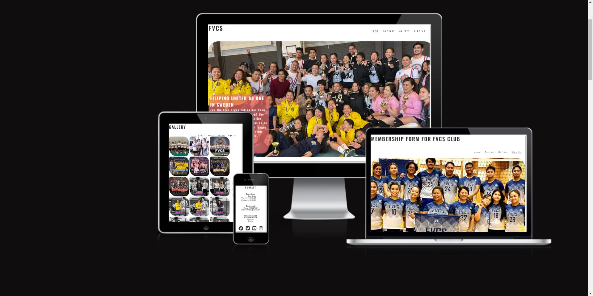
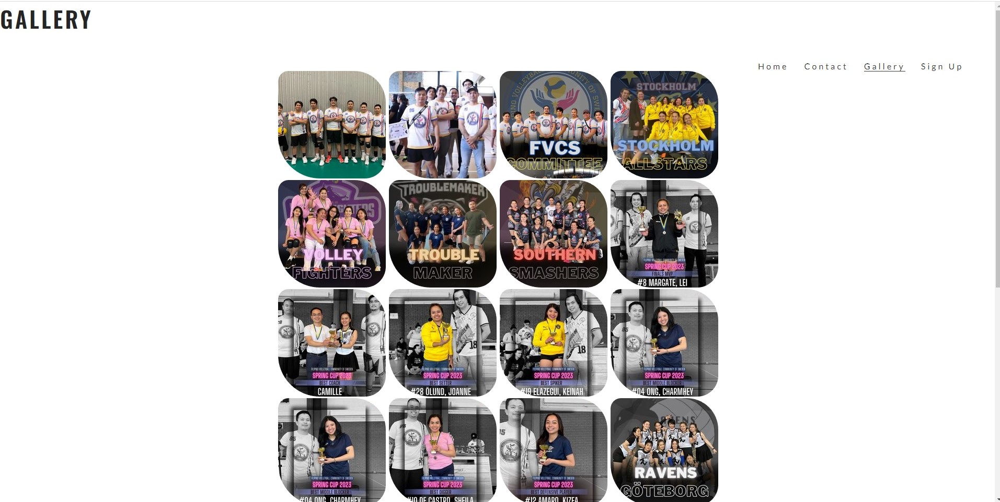
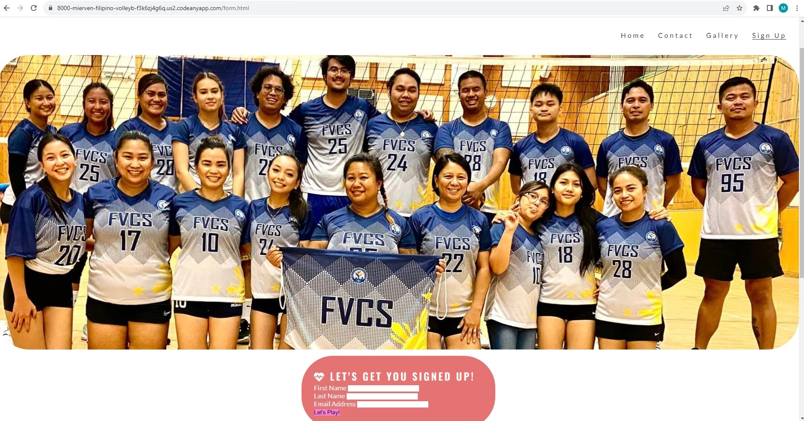
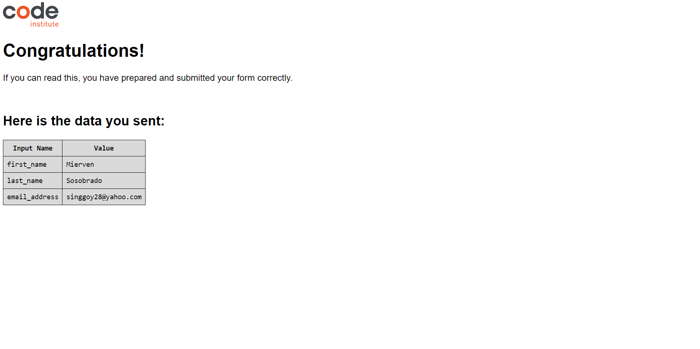
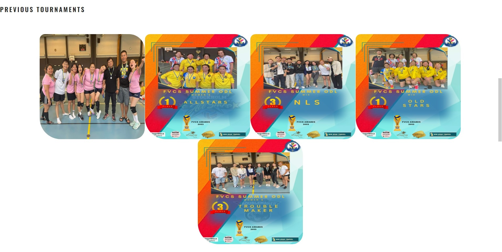
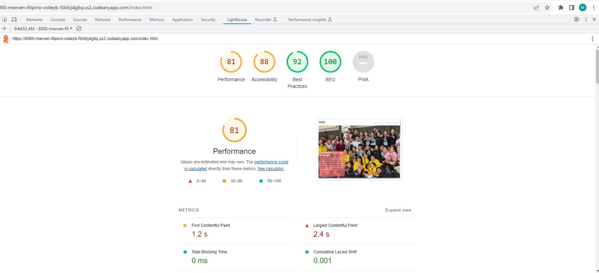

# Filipino Volleyball Club

This website is a sports organizations club for filipinos living and working in Sweden, where the filipinos united by joining the club through registration. This site helps filipinos residing Sweden to be socialize and also contribute everyones health by joining to the volleyball club.

This will provide also information of previous and future events and activities to be held locally and even inter-europian tournament somewhere in Sweden and outside of the country.

Features

### Existing Features

- Navigation Bar
- Featured on all the pages, the full responsive navigation bar includes, gallery and sign up forms.
- This section will allow the user to easily navigate from page to page across all devices without having to revert back to the previous page via the ‘back’ button.

## Landing Page

Index HTML is our homepage and introduction of the organization/club and also describes its purpose which filipinos  living in Sweden are being united as one. 

Whereas navagation bar is located for the user to navagate each containing pages within the website.

## Gallery

With the Gallery page, the user will able to see member and staffs who contribute by making the organization/club active and facilatet some training and tournaments. 

Within the gallery differents team also presented with previous tournament and even some special awrdies of the previous events. 

## Log-in/Sign-up

On this page we have the simple login/sign up features for new and old members to be able to log in. For now i am using <https://formdump.codeinstitute.net/> for the user to see there registration form or the data that that has been submitted with their infromation, first-name last-name and email_address.

## Previous-tournaments

The user sees previous tournaments done and able to see the team awardies, third runner-up, second runner-up and fisrt runner-up and the champions.

## Features left to Implement

- None left through CSS or HTML. It would require Java script to add back ends feedback and log in features.

## Testing

I tested it my self and honestly it very tough in the first place for the reason that i am a begginer, i spend a lot of hours, days configuring how to make my website works and able to come up with at least a simple and effective website.

I believe i made a website that will works and easy to access with corresponing navagation bar of each pages containing a website features. I done testing many meadia query for the website be able to fit differents screen sizes. 

 

## Validator Testing

- HTML
  - No error will returned when passing through the official W3C validator.
- CSS
  - No error will returned when passing through the official W3C css Jigsaw Validator.
- Accessibility
  - There were also very good results from the Light house as three values were green and one above 60%.
  - 

 ## Unfixed Bugs
  - No unfixed bugs

## Deployment

This section should describe the process you went through to deploy the project to a hosting platform (e.g. GitHub)

- The site was deployed to GitHub pages. The steps to deploy are as follows:
  - In the GitHub repository, navigate to the Settings tab
  - From the source section drop-down menu on the left. Click Pages, Then select Main as Branch.
  - Once the master branch has been selected, the page will be automatically refreshed with a detailed ribbon display to indicate the successful deployment.

The live link can be found here - <https://mierven.github.io/Filipino-VolleyballClub-Sweden/>

## Credits

- All Media as pictures and logos I have found on FVCS facebook page. [Facebook](https://www.facebook.com/filipinovolleyballcommunityofsweden)
- The Icons in the footer were taken from [Font Awesome](https://fontawesome.com/)
- Some of the codes is taken from Code Institute love-running project.
- I found also some tutorial from [Responsive image](<https://www.youtube.com/>)
